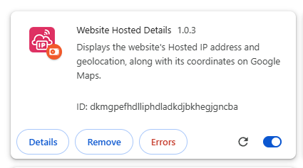
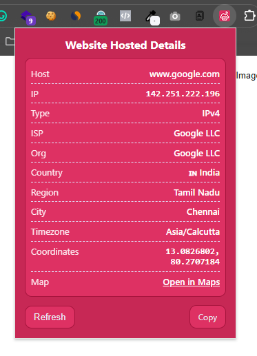
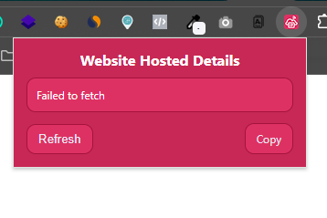

# Website Hosted Details - Extension

Website Hosted IP & Geolocation Finder is a simple Chrome Extension that displays the website's hosted IP address and geolocation, along with its exact coordinates on Google Maps, helping you quickly identify server details with a single click.

---

## 🚀 Features
- Display the host and IP address of the current website 
- Show connection type and ISP information 
- View organization, country, region, and city details 
- Show exact coordinates and interactive Google Maps location
- Display timezone of the website/server
- Copy all details to clipboard with a single click
- Lightweight, fast, and easy-to-use Chrome Extension (Manifest V3)  

## 📦 Installation
Download or clone this repository: `website-hosted-details`
- Open Chrome and go to chrome://extensions/
- Enable Developer mode (top-right corner)
- Click Load unpacked and select this project folder
- The extension will appear in your browser toolbar 🎉

## 🖼️ Screenshots

## ⚙️ Tech Info
- Manifest Version: 3
- Permissions: activeTab, tabs
- Content Script: Runs on all sites `<all_urls>`
- host_permissions: `https://dns.google/*, https://ipwho.is/`

## ⚙️ Compatibility
Works with all Chromium-based browsers, tested on:
- Google Chrome
- Brave
- Microsoft Edge
- Vivaldi

## ⚖️ License & Copyright
- Copyright © **Raisul Islam Shagor** 
- Contact: deploy@raisul.dev
- Website: https://raisul.dev/
